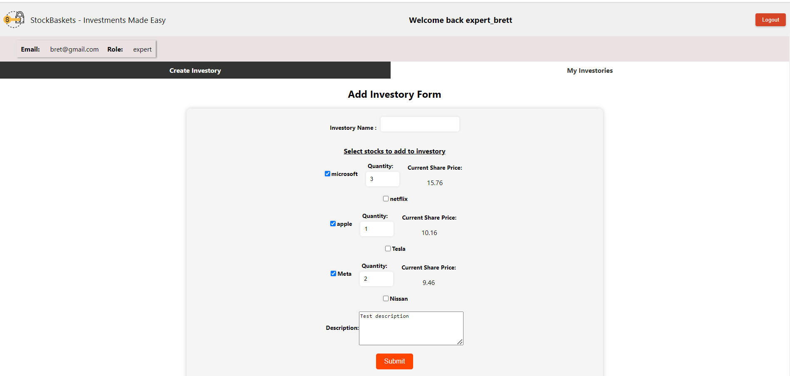

<a name="readme-top"></a>

<!-- TABLE OF CONTENTS -->

 ## Table of Contents
  <ol>
    <li>
      <a href="#about-the-project">About The Project</a>
      <ul>
        <li><a href="#user-requirements">User Requirements</a></li>
        <li><a href="#built-with">Built With</a></li>
        <li><a href="#api-endpoints-used-in-fetch">API Endpoints used in Fetch</a></li>
        <li><a href="#snapshots-of-project">Snapshots of Project</a></li>
        <li><a href="#project-demo">Project Demo</a></li>
      </ul>
   </li>
   <li>
      <a href="#getting-started">Getting Started</a>
      <ul>
        <li><a href="#prerequisites">Prerequisites</a></li>
      </ul>
   </li>
  </ol>


<!-- ABOUT THE PROJECT -->
## About The Project

 **'StockBaskets'** is a full-stack stock management app consisting of two major user roles - Investor and Expert. The app seeks to provide stock experts a platform to create baskets of stocks (called 'investories') choosing the composition and ratio of stocks in any basket; and allows investors to make investments in these expert-curated investories on a subscription based model. 

### User Requirements
The high-level user requirements for the project are as follows:
1. Investors and Experts must be authenticated/authorized to perform role-related tasks
2. Investors must be able to view their real-time wallet, total amount invested, and net portfolio value once authenticated
3. Investors should be able to add money to their wallet
4. Investors must be able to view all experts and subscribe to experts on a quarterly, monthly or annual basis
5. Investors must be able to view all created investories
6. Investors must only be able to make/update investments in investories once they subscribe to its owning experts.
7. Investors should only be able to see stock composition stats of an investory while they are subscribed to its owning expert
8. Investors should be able to withdraw from investments even when  unsubscribed
9. Experts must be able to create investories selecting stock composition and share quantity for the stocks in that composition.
10. Experts should be able to view all created investories

<p align="right"><a href="#readme-top">(back to top)</a></p>

### Built With
The Project utilizes the following APIs, frameworks and tools:

__Backend__ 
* Springboot
* Hibernate
* Node.js
* MySQL

__Frontend__
* React.js
* Redux
* CSS 

<p align="right"><a href="#readme-top">(back to top)</a></p>

### API Endpoints used in Fetch

The following fetch API end points are used :

*Send register request*:
 ```sh
  POST /auth/register
  body:
  {
    "username" : "gabriel",
    "email" : "gabriel@gmail.com",
    "password" : "test123",
    "role" : "(expert or investor)"
}
  ```

*Send login request*:
 ```sh
  POST /auth/login
  body:
{
    "role" : "(investor or expert)"
}
```

*Retrieve all investors*:
 ```sh
  GET /investors
  ``` 

*Retrieve investor by id*:
 ```sh
  GET /investors/{investor_id}
  ``` 

*Retrieve expert by id*:
 ```sh
  GET /iexperts/{expert_id}
  ``` 

*Update investor wallet*:
 ```sh
  PUT /investors/{investor_id}/wallet
  body:
  {
    "amount" : 500
  }
  ```
  
*Create a subscription request*:
 ```sh
  POST /subscriptions
  body:
  {
    "expertId" : 1,
    "investorId": 5,
    "price" : 60,
    "type" : "MONTHLY"
  }
  ``` 

*Retrieve all experts*:
 ```sh
  GET /experts
  ``` 

*Retrieve all subscriptions with optional params of investor id and expert id*:
 ```sh
  GET /subscriptions?investorId={investor_id}?expertId={expert_id}
  ``` 

*Delete a subscription*:
 ```sh
  DELETE /subscriptions/{subscription_id}
  ``` 

*Create a new stock*:
 ```sh
  POST /market/stocks
  body:
  {
    "currentSharePrice" : 40,
    "company" : "Nissan"
  }
  ``` 

*Retrieve all stocks*:
 ```sh
  GET /market/stocks
  ``` 

*Create an investory*:
```sh
  POST /investories
  body:
  {
  "expertId": 5,
  "description" : "Gabriel's first basket",
  "investoryName" : "My First Investory",
  "quantifiedStocks": [
    {
      "stock": {
        "id": 1,
        "company": "microsoft",
        "currentSharePrice": 15.0
      },
      "qty": 2
    },
    {
      "stock": {
        "id": 2,
        "company": "netflix",
        "currentSharePrice": 25.0
      },
      "qty": 3
    }
  ]
}
```

*Update an investory*:
```sh
  PUT /investories/{investory_id}
  body:
  {
  "expertId": 1,
  "description" : "This year, the prices of netflix and microsoft shares are expected to grow tremendously in this ratio.",
  "quantifiedStocks": [
    {
      "stock": {
        "id": 1,
        "company": "microsoft",
        "currentSharePrice": 15.0
      },
      "qty": 14
    },
    {
      "stock": {
        "id": 2,
        "company": "netflix",
        "currentSharePrice": 25.0
      },
      "qty": 7
    }
  ]
}
```

*Retrieve all investories*:
 ```sh
  GET /investories
  ``` 

*Retrieve all investments*:
 ```sh
  GET /investors/investments
  ``` 

*Make new investment*:
 ```sh
  POST /investors/{investor_id}/investments
  body:
      {
        "investoryId" : 1,
        "investorySharesToAdd" : 2,
        "investmentAmountToAdd" : 74
    }
  ``` 

*Withdraw from an investment*:
 ```sh
  DELETE /investors/{investor_id}/investments/{investment_id}
  ``` 

*Update an investment*:
 ```sh
  PUT /investors/{investor_id}/investments/{investment_id}
  body:
      {
      "investorySharesToAdd" : 1,
      "investmentAmountToAdd" : 37
      }
  ``` 

*Retrieve all investments for an investor*:
 ```sh
  GET /investors/{investor_id}/investments
  ``` 

*Update stock prices in market (fixed to 5% up or down)*:
 ```sh
  PUT /market
  ``` 

<p align="right"><a href="#readme-top">(back to top)</a></p>

### Snapshots of Project

<h4>Home Page</h4>


<h4>Register Modal</h4>


<h4>Login Modal</h4>


<h4>Investor Page - Investories Tab</h4>


<h4>Investor Page - Experts Tab</h4>


<h4>Investor Page - Add to Wallet Modal</h4>


<h4>Investor Page - Investory</h4>


<h4>Investor Page - Make Investment Modal</h4>


<h4>Investor Page - Update Investment Modal</h4>


<h4>Expert Page - Create Investory Form</h4>


<h4>Expert Page - Investory List</h4>


<p align="right"><a href="#readme-top">(back to top)</a></p>

### Project Demo
<video controls>
  <source src="./videos/project_demo.mp4" type="video/mp4">
</video>

<!-- GETTING STARTED -->
## Getting Started

Clone this repository, and and follow the instructions to install pre-requisites before running the project

### Prerequisites

Before running this project, the MySQL datasource configuration (url,username,password) needs to be done in:
 ```sh
  'investmentapp_backend/src/main/resources/hibernate.cfg.xml'
  ```
The backend server can then be started which has functional endpoints for the GET, PUT, POST and DELETE requests mentioned in <a href = "#api-endpoints-used-in-fetch">API Endpoints used in Fetch</a>.

The backend server hosting the endpoints is a maven project in the **'investmentapp_backend'** folder. The dependencies are defined in the **'pom.xml'** file. The server can be deployed using the IDE build and run  buttons. 

The frontend server hosting the react-app can be run once inside the **'investmentapp_frontend'** folder in the terminal using the command : 
 ```sh
  npm run start
  ```

This will execute the script 'start' defined in package.json which is an alias for the `react-scripts start` command which runs the app.